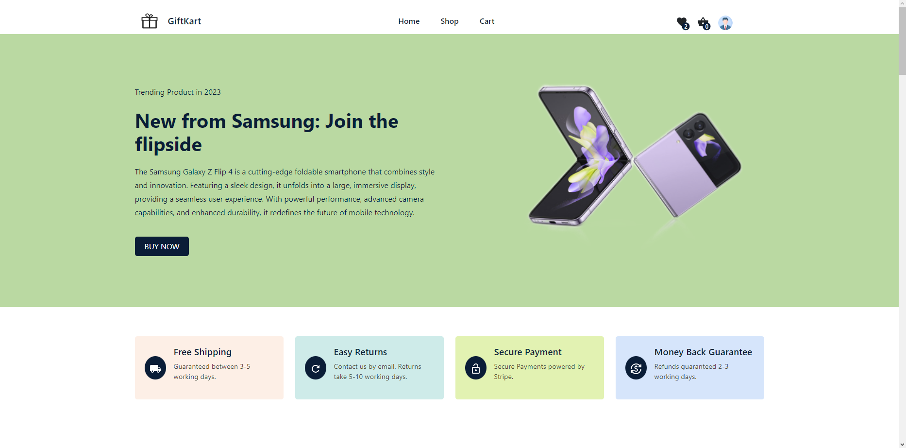

<div id='top'></div>
<br/>
<div align='center'>
<h2 align="center">GiftKart</h2>

  <p align="center">
    A ecommerces website built using Vite, react & redux along with; Material UI, Firebase authenitication, Firebase storage, framer-motion and sass.
    <br />
    <br />
    <a href="https://giftkart.vercel.app">View Demo</a>
    ·
    <a href="https://github.com/KingGift17">Report Bug</a>
  </p>
</div>

<!-- ABOUT THE PROJECT -->

  

## Additional Images

  <p align='center'>
    
    
    
  </p>

### Built Using

- [Vite](https://vitejs.dev/)
- [React](https://react.dev/)
- [Material UI](https://mui.com/)
- [Firebase](https://firebase.google.com)
- [Redux](https://redux.js.org)
- [Framer-Motion](https://www.framer.com/motion/)

<p align="right">(<a href="#top">back to top</a>)</p>
<!-- GETTING STARTED -->

## Getting Started

If you would like to build this app locally for yourself just follow the instructions below.

### Node Version

v18.13.0

### Installation

1. Clone the repo

   ```bash
   git clone https://github.com/KingGift17/giftkart.git
   ```

2. Install Packages

   ```bash
   npm install
   ```

3. Run a Build

   ```bash
   npm run build
   ```

4. Start the App

   ```bash
   npm run dev
   ```

### Deployment

1. Clone the repo

   ```bash
   npm run build
   ```

2. Install Packages

   ```bash
   npm install vite@latest
   npm install @mui/material @emotion/react @emotion/styled
   npm install @mui/icons-material
   npm install @react-redux
   ```

<!-- CONTACT -->

Ovie Gift Bazunu - obaz1717@gmail.com
LinkedIn - www.linkedin.com/in/ovie-g-bazunu

<p align="right">(<a href="#top">back to top</a>)</p>
